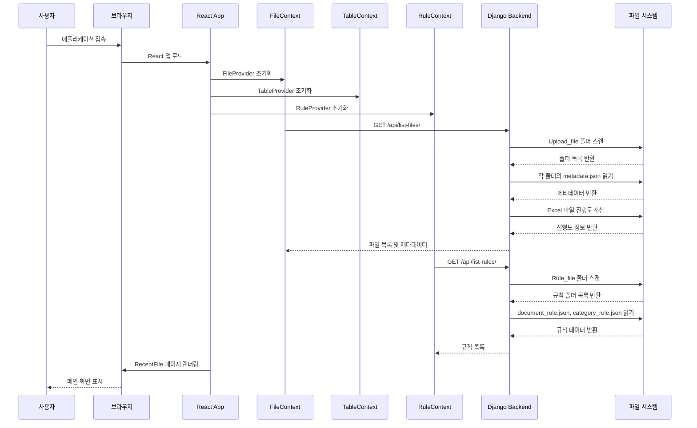
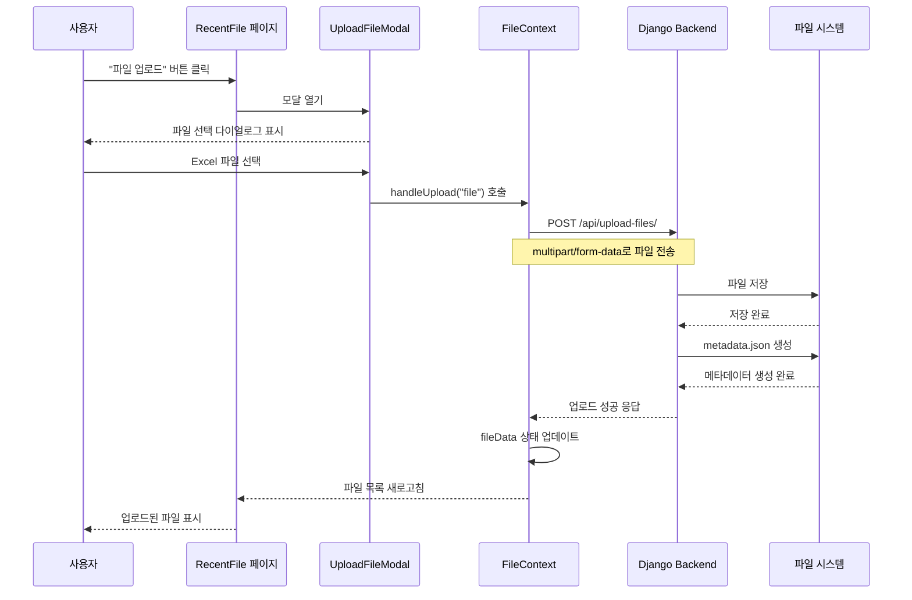
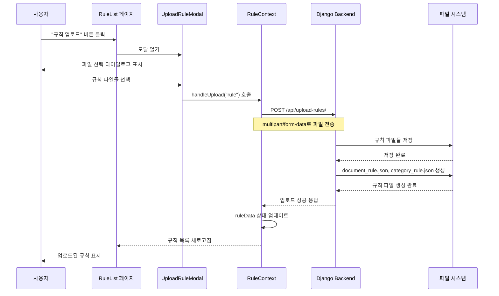
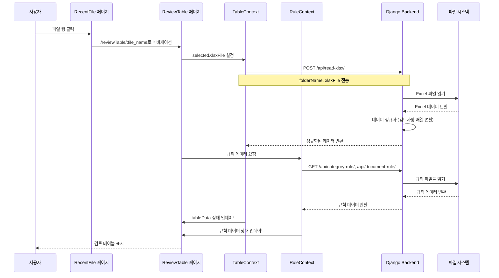
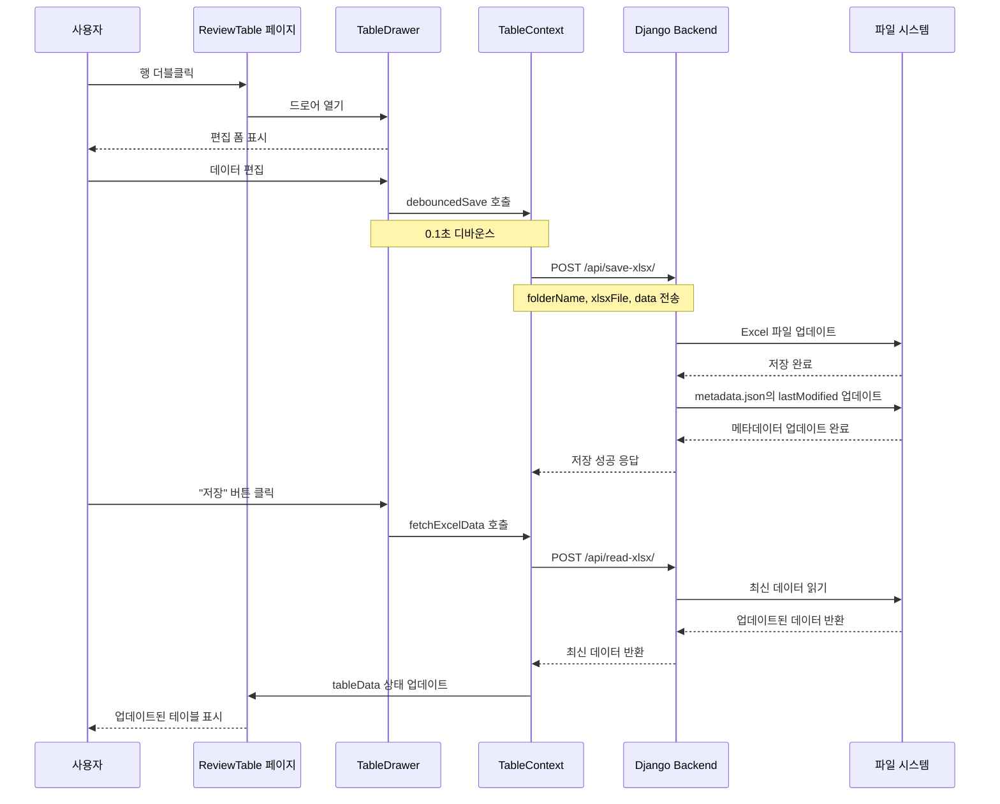
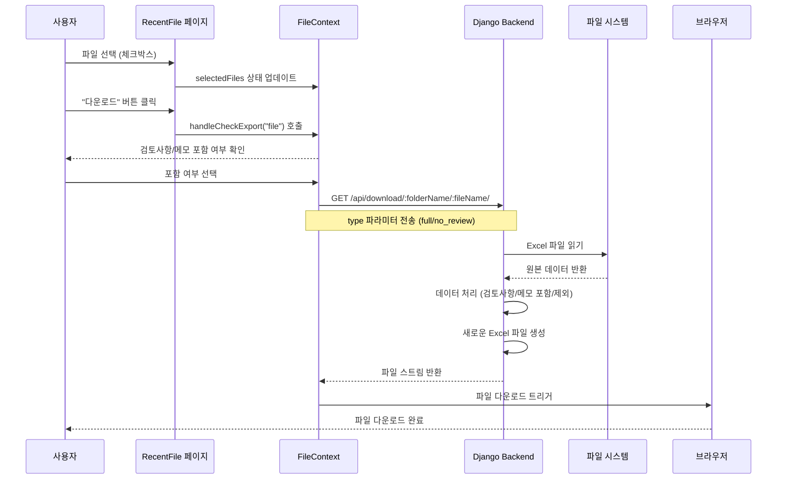
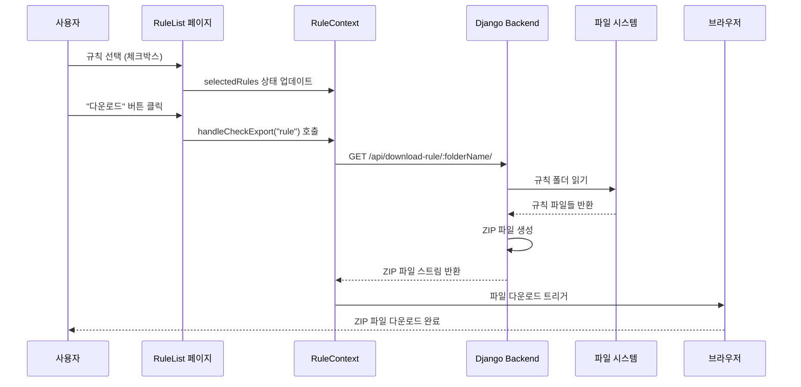
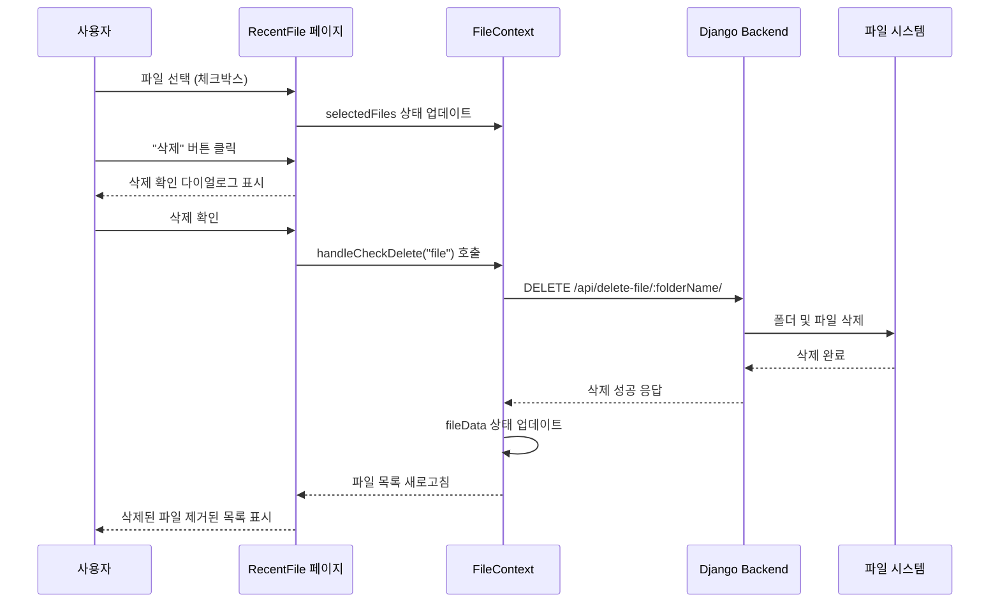
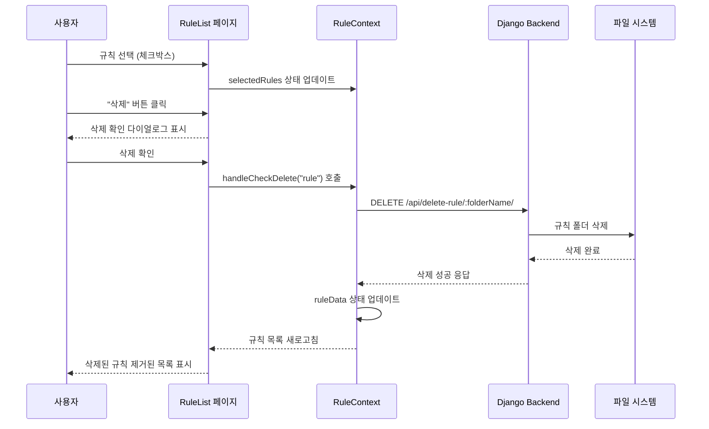
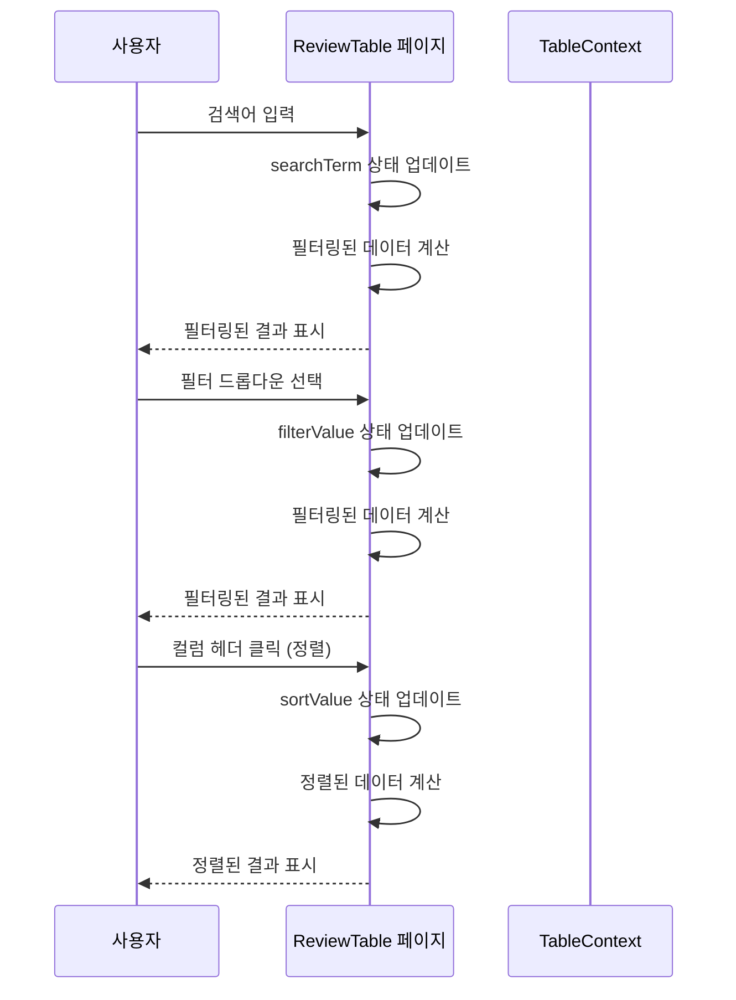

# AuditMate 소프트웨어 전체 시퀀스 다이어그램

## 1. 애플리케이션 시작 및 초기화

## 2. 파일 업로드 프로세스

## 3. 규칙 업로드 프로세스

## 4. 파일 검토 프로세스

## 5. 데이터 편집 및 저장 프로세스

## 6. 파일 다운로드 프로세스

## 7. 규칙 다운로드 프로세스

## 8. 파일 삭제 프로세스

## 9. 규칙 삭제 프로세스

## 10. 검색 및 필터링 프로세스

## 주요 컴포넌트 설명

### Frontend (React)
- **App.js**: 메인 라우팅 및 Context Provider 설정
- **RecentFile.js**: 파일 목록 관리 페이지
- **ReviewTable.js**: Excel 데이터 검토 페이지
- **RuleList.js**: 규칙 관리 페이지
- **TableDrawer.js**: 데이터 편집 드로어

### Context (상태 관리)
- **FileContext**: 파일 업로드, 다운로드, 삭제 관리
- **TableContext**: Excel 데이터 로드, 저장, 편집 관리
- **RuleContext**: 규칙 데이터 관리
- **DrawerContext**: 드로어 상태 관리

### Backend (Django)
- **views.py**: API 엔드포인트 처리
- **settings.py**: Django 설정
- **urls.py**: URL 라우팅

### 주요 API 엔드포인트
- `GET /api/list-files/`: 파일 목록 조회
- `GET /api/list-rules/`: 규칙 목록 조회
- `POST /api/upload-files/`: 파일 업로드
- `POST /api/upload-rules/`: 규칙 업로드
- `POST /api/read-xlsx/`: Excel 파일 읽기
- `POST /api/save-xlsx/`: Excel 파일 저장
- `GET /api/download/:folderName/:fileName/`: 파일 다운로드
- `DELETE /api/delete-file/:folderName/`: 파일 삭제
- `DELETE /api/delete-rule/:folderName/`: 규칙 삭제 